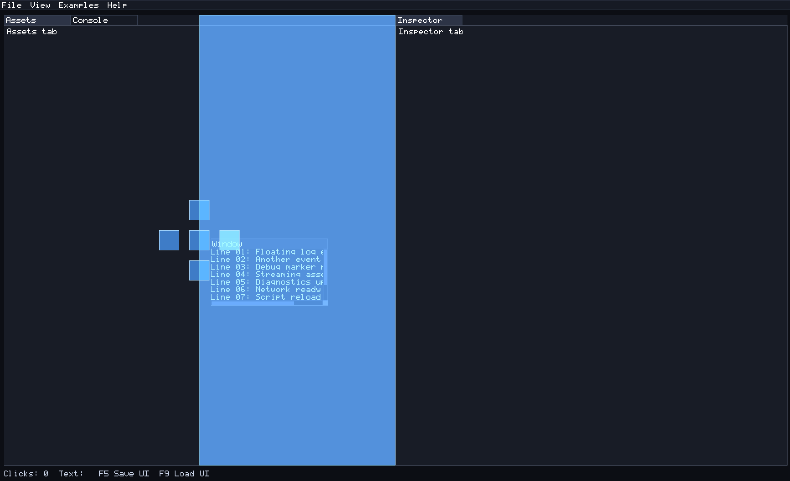
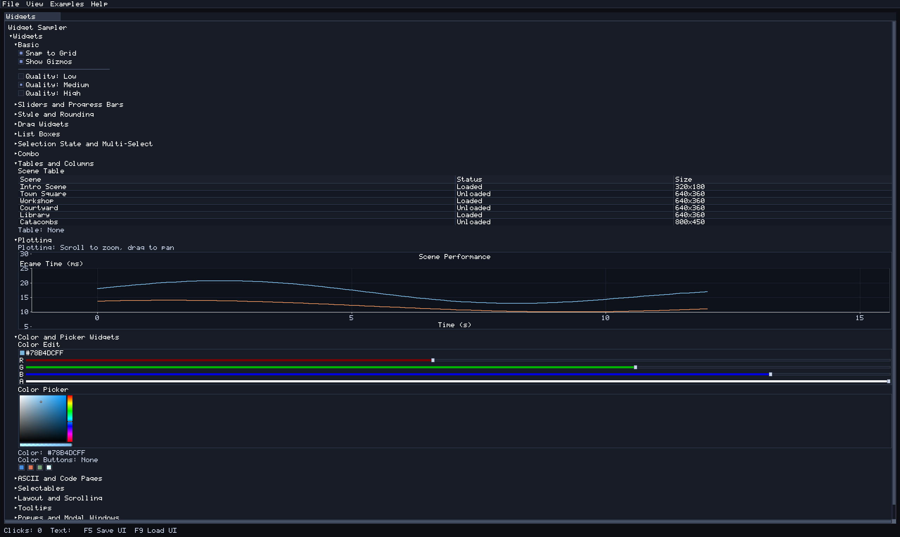

# OpenControls

OpenControls is a lightweight, renderer-agnostic UI logic library. It keeps control behavior separate from rendering so host apps (MonoGame, tooling, or custom engines) can share the same UI logic.

## Quick Links
- `README.MD`: this overview.
- `Quickstart.MD`: getting started guide.
- `API.MD`: core types and controls reference.
- `Samples.MD`: small usage examples.
- `LICENSE.MD`: MIT license.

## Goals
- Keep UI behavior and input handling independent from rendering APIs.
- Use a retained element tree so controls manage their own state.
- Provide a small, predictable control set for editor and runtime use.
- Keep layout explicit (manual bounds) so host apps stay in control.

## Screenshots

### Docked Layout

### Examples Overview

## Projects
- `OpenControls.Examples`: shared examples UI library (renderer-agnostic).
- `OpenControls.MonoGame`: MonoGame DesktopGL renderer adapter library.
- `OpenControls.MonoGame.Examples`: runnable MonoGame host for the shared examples UI.
- `OpenControls.SdlNet.Examples`: SDL2-CS renderer example that mirrors the OpenControls.Examples UI (requires SDL2 native runtime; on Windows place `SDL2.dll` on PATH or beside the executable).

## Renderers
OpenControls is renderer-agnostic; hosts provide an `IUiRenderer` implementation.

Current adapters:
- MonoGame DesktopGL (OpenControls.MonoGame).
- SDL2-CS (OpenControls.SdlNet.Examples).

Planned expansion:
- OpenGL or other native renderers.
- Headless test harnesses.

## Status
- Core element tree, focus management, and basic controls are implemented.
- Checkbox, radio, slider, drag (scalar/vector/range with log scaling), progress bar, list box, combo box, selectable, color button, and separator controls are available.
- Table controls with column headers and selectable rows are available.
- Plotting panel control supports axes, tick labels, grid lines, and zoom/pan input.
- Grid layout control assigns children to rows/columns with spacing and padding.
- Canvas control supports pan/zoom with optional grid and origin helpers.
- Color edit and color picker controls include gradient SV, alpha bars, and checkerboard transparency.
- Multi-select selection model for list boxes and selectables (Ctrl/Shift range) is available.
- Scroll panels support auto/always scrollbars for overflowing content.
- Windows can host optional scroll panels for overflow content (shown in docked/floating examples).
- Window and dock host controls support tabbed layouts.
- Dock workspaces support drag previews, drop targets, and floating windows.
- Menu bar control supports dropdowns, checkable items, nested submenus, popup menus, and embedded content.
- Tree nodes, collapsing headers, tooltips, popups, and modals are available.
- Splitter control provides draggable horizontal/vertical splits for manual layouts.
- Arrow glyph helper (`UiArrow`) keeps tree/combo/menu indicators consistent.
- Common controls support rounded corners and masking for clipped children via `CornerRadius` and `UiRenderHelpers` helpers.
- Panels and windows support child clipping and resize grips.
- UI state serialization is available for layout persistence.
- OpenControls.MonoGame.Examples renders the shared examples UI using MonoGame DesktopGL (via OpenControls.MonoGame).
- OpenControls.SdlNet.Examples renders the shared examples UI using SDL2-CS.
- OpenControls.Examples includes an Examples menu to open feature windows as dockable panels.
- OpenControls.Examples widgets window groups controls into categorized tree nodes (collapsed by default, with header spacing).
- A dedicated UI editor is planned and will be documented once available.
- OpenControls includes a TinyBitmapFont helper that covers full printable ASCII plus Latin-1/CP437 code pages (shown in the Widgets ASCII table).
