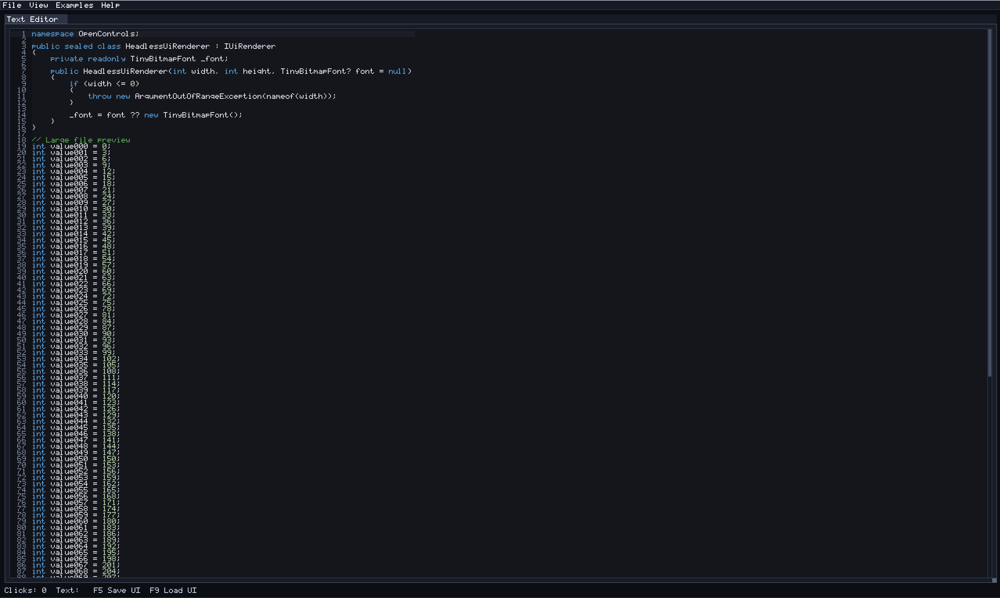

# OpenControls

OpenControls is a lightweight, renderer-agnostic UI logic library. It keeps control behavior separate from rendering so host apps (MonoGame, tooling, or custom engines) can share the same UI logic.

## Quick Links
- `README.MD`: this overview.
- `Quickstart.MD`: getting started guide.
- `API.MD`: core types and controls reference.
- `Samples.MD`: small usage examples.
- `tools/parity/`: widget + demo parity manifests.
- `scripts/verify-examples.ps1`: parity + build verification for the Examples demo.
- `LICENSE.MD`: MIT license.

## Goals
- Keep UI behavior and input handling independent from rendering APIs.
- Use a retained element tree so controls manage their own state.
- Provide a small, predictable control set for editor and runtime use.
- Keep layout explicit (manual bounds) so host apps stay in control.

## Screenshots

### Docked Layout

### Examples Overview

### Text Editor

## Projects
- `OpenControls.Examples`: shared examples UI library (renderer-agnostic).
- `OpenControls.MonoGame`: MonoGame DesktopGL renderer adapter library.
- `OpenControls.MonoGame.Examples`: runnable MonoGame host for the shared examples UI.
- `OpenControls.SdlNet`: SDL2-CS renderer adapter library.
- `OpenControls.OpenGL`: OpenGL renderer adapter library (OpenTK).
- `OpenControls.OpenGL.Examples`: runnable OpenGL host for the shared examples UI.
- `OpenControls.SdlNet.Examples`: SDL2-CS renderer example that mirrors the OpenControls.Examples UI (requires SDL2 native runtime; on Windows place `SDL2.dll` on PATH or beside the executable).

## Usage
- Build the core library: `dotnet build OpenControls/OpenControls.csproj`
- Run the MonoGame examples: `dotnet run --project OpenControls.MonoGame.Examples/OpenControls.MonoGame.Examples.csproj`
- Run the OpenGL examples: `dotnet run --project OpenControls.OpenGL.Examples/OpenControls.OpenGL.Examples.csproj`
- Run parity verification (widgets + demos): `powershell -ExecutionPolicy Bypass -File scripts/verify-parity.ps1`
- Run demo parity + build verification: `powershell -ExecutionPolicy Bypass -File scripts/verify-examples.ps1`
- Refresh parity manifests after adding/removing widgets or demo markers: `powershell -ExecutionPolicy Bypass -File scripts/verify-parity.ps1 -Update`

## Demo Parity (OpenControls.Examples)
The Widgets window in `OpenControls.Examples` mirrors the structure of the reference demo source. Every demo marker was replaced with a working OpenControls demo panel so the tree now maps to the same sections (Help & Configuration, Menu, Basic widgets, Text, Sliders, Drag & Drop, Tables, Layout, Inputs & Focus, Tools, Examples, etc.).

Parity deviations (documented and intentional):
- Shortcuts + mouse cursors: OpenControls input only exposes Ctrl/Shift, navigation keys, and text input, so shortcuts are approximated from text input and cursor-shape changes are not shown.
- Drag/slider flags: the demo toggles whole-number snapping and step size; advanced flags like logarithmic and always-clamp are not available.
- Text input callbacks: completion/history is simulated; OpenControls does not expose edit callbacks.
- WantCapture overrides: the capture checkboxes are informational only; host-specific capture routing is not exposed in OpenControls.
- Image demos: `UiImage` and `UiImageButton` rely on renderer-supplied textures, so hosts without texture bindings will show placeholders.
- Item/window status queries: status labels use hit-testing and focus tracking, not the full item status flag set.

## Parity Tracking
OpenControls tracks parity with the reference snapshot using two sources and two manifests:
- `widgets/`: analyzed widget references from the reference snapshot (one file per widget).
- `DEMO_MARKERS_run-20260123-031959-5835.md`: extracted demo markers from the reference demo source.
- `tools/parity/widgets.json`: maps each widget entry to OpenControls implementation references.
- `tools/parity/demo-markers.json`: maps each demo marker to OpenControls.Examples coverage.

Parity workflow:
1. Update widgets or demo markers, then run `scripts/verify-parity.ps1 -Update` to refresh manifests.
2. Mark each entry with a completion status (`done`, `covered`, `implemented`, or `complete`) and add implementation/example paths or notes.
3. Use relative paths in `implementation` or `examples` to point at the relevant code or example location (files or directories).
4. Run `scripts/verify-parity.ps1` to enforce widget + demo parity coverage.

Parity validation rules:
- Every widget entry must be marked complete and have at least one `implementation` path or a `notes` entry.
- Every demo marker must be marked complete and have at least one `examples` path or a `notes` entry.
- Paths are checked for existence to keep the manifests anchored to real code or example locations.

## Project Status Matrix
| Project | Type | Status | Notes |
| --- | --- | --- | --- |
| `OpenControls` | Core UI library | Active | Renderer-agnostic UI logic. |
| `OpenControls.Examples` | Shared UI | Active | Shared examples UI used by hosts. |
| `OpenControls.MonoGame` | Renderer adapter | Active | MonoGame DesktopGL adapter. |
| `OpenControls.MonoGame.Examples` | Host app | Active | MonoGame examples host. |
| `OpenControls.SdlNet` | Renderer adapter | Active | SDL2-CS adapter. |
| `OpenControls.SdlNet.Examples` | Host app | Active | Requires `SDL2.dll` at runtime. |
| `OpenControls.OpenGL` | Renderer adapter | Active | OpenTK compatibility-profile adapter. |
| `OpenControls.OpenGL.Examples` | Host app | Active | OpenTK OpenGL host. |

## Supported Widgets
- Core: `UiPanel`, `UiLabel`, `UiTextBlock`, `UiTextLink`, `UiBullet`, `UiBulletText`, `UiButton`, `UiArrowButton`, `UiSeparator`, `UiSeparatorText`, `UiSpacer`, `UiDisabledGroup`.
- Inputs: `UiCheckbox`, `UiRadioButton`, `UiTextField`, `UiTextEditor`, `UiInputFloat/Int/Double`, `UiInputFloat2/3/4`, `UiInputInt2/3/4`, `UiNumericField`, `UiNumericVector`, `UiSlider`, `UiSliderFloat2/3/4`, `UiSliderInt2/3/4`, `UiSliderVector`, `UiVSlider`, `UiDragFloat`, `UiDragInt`, `UiDragFloat2/3/4`, `UiDragInt2/3/4`, `UiDragFloatRange`, `UiDragIntRange`.
- Lists and tables: `UiListBox`, `UiSelectable`, `UiComboBox`, `UiTable`.
- Data display: `UiProgressBar` (horizontal/vertical, segmented, radial), `UiPlotPanel`, `UiWaveform`, `UiColorEdit`, `UiColorPicker`, `UiColorButton`, `UiImage`, `UiImageButton`.
- Layout: `UiGrid`, `UiSplitter`, `UiScrollPanel`, `UiCanvas`, `UiWindow`, `UiDockHost`, `UiDockWorkspace`.
- Interaction: `UiTabBar`, `UiTabItem`, `UiTabItemButton`, `UiDragDropSource`, `UiDragDropTarget`.
- Overlays: `UiMenuBar`, `UiTreeNode`, `UiCollapsingHeader`, `UiTooltip`, `UiTooltipRegion`, `UiPopup`, `UiModal`, `UiModalHost`.

## Renderers
OpenControls is renderer-agnostic; hosts provide an `IUiRenderer` implementation.

Current adapters:
- MonoGame DesktopGL (OpenControls.MonoGame).
- SDL2-CS (OpenControls.SdlNet).
- OpenGL (OpenControls.OpenGL).

Planned expansion:
- OpenGL or other native renderers.
- Headless test harnesses.

## Status
- Core element tree, focus management, and basic controls are implemented.
- Checkbox, radio, slider, drag (scalar/vector/range with log scaling), progress bar (horizontal/vertical, segmented, radial), list box, combo box, selectable, color button, and separator controls are available.
- Table controls with column headers and selectable rows are available.
- Table headers support angled labels and sortable columns via `UiTable.UseAngledHeaders` and `UiTable.SortSpecs`.
- Plotting panel control supports axes, tick labels, grid lines, and zoom/pan input.
- Waveform control renders sample buffers with min/max or line modes and an optional zero line.
- Grid layout control assigns children to rows/columns with spacing and padding.
- Canvas control supports pan/zoom with optional grid and origin helpers.
- Color edit and color picker controls include gradient SV, alpha bars, and checkerboard transparency.
- Multi-select selection model for list boxes and selectables (Ctrl/Shift range) is available.
- Scroll panels support auto/always scrollbars for overflowing content.
- Windows can host optional scroll panels for overflow content (shown in docked/floating examples).
- Window and dock host controls support tabbed layouts with close buttons and overflow scrolling.
- Tab bars support `UiTabItemButton` with leading/trailing placement.
- Tabs, window titles, table headers, tree node headers, and labels can render bold text.
- Dock workspaces support drag previews, drop targets, and floating windows.
- Drag/drop payloads are supported via `UiDragDropSource`, `UiDragDropTarget`, and `UiDragDropContext`.
- Menu bar control supports dropdowns, checkable items, nested submenus, popup menus, and embedded content.
- Tree nodes, collapsing headers, tooltips, popups, and modals are available.
- Text editor control supports line numbers, scrolling, and syntax highlighting.
- Text fields support placeholder text via `UiTextField.Placeholder` and `UiTextField.PlaceholderColor`.
- Numeric input fields (`UiInputFloat/Int/Double`, `UiNumericField`, and vector variants) and vector sliders (`UiSliderFloat2/3/4`, `UiSliderInt2/3/4`, `UiSliderVector`) are available.
- Image widgets (`UiImage`, `UiImageButton`) support renderer-specific draw callbacks for texture-backed UI.
- Splitter control provides draggable horizontal/vertical splits for manual layouts.
- Arrow glyph helper (`UiArrow`) keeps tree/combo/menu indicators consistent.
- Common controls support rounded corners and masking for clipped children via `CornerRadius` and `UiRenderHelpers` helpers.
- Panels and windows support child clipping and resize grips.
- UI state serialization is available for layout persistence.
- OpenControls.MonoGame.Examples renders the shared examples UI using MonoGame DesktopGL (via OpenControls.MonoGame).
- OpenControls.SdlNet.Examples renders the shared examples UI using SDL2-CS (via OpenControls.SdlNet).
- OpenControls.OpenGL provides an OpenTK-based renderer adapter (compatibility profile).
- OpenControls.OpenGL.Examples renders the shared examples UI using OpenGL (via OpenControls.OpenGL).
- OpenControls.Examples includes an Examples menu to open feature windows as dockable panels.
- OpenControls.Examples includes a dedicated Text Editor demo window.
- OpenControls.Examples widgets window groups controls into categorized tree nodes (collapsed by default, with header spacing).
- A dedicated UI editor is planned and will be documented once available.
- OpenControls includes a TinyBitmapFont helper that covers full printable ASCII plus Latin-1/CP437 code pages (shown in the Widgets ASCII table).
