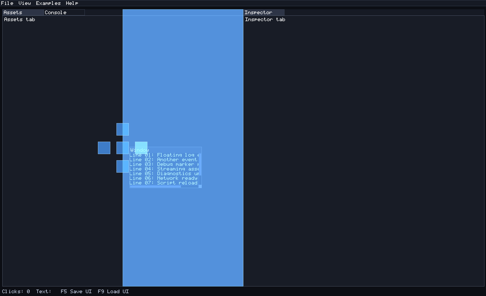
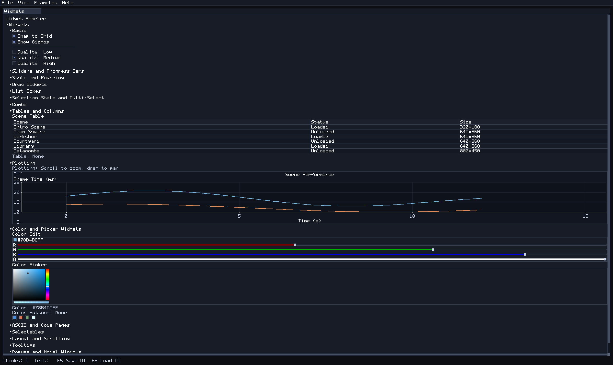
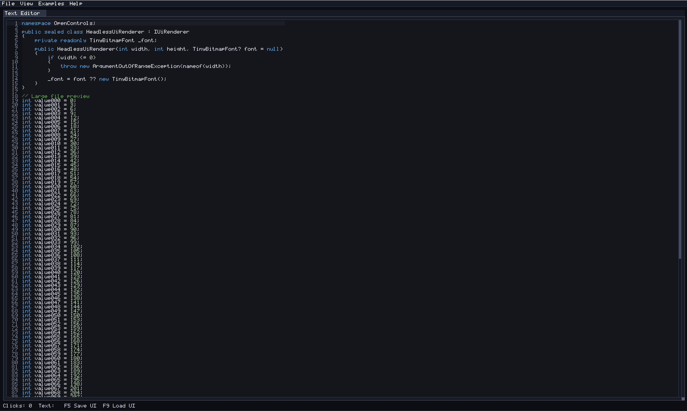

# OpenControls

OpenControls is a lightweight, renderer-agnostic UI logic library. It keeps control behavior separate from rendering so host apps (MonoGame, tooling, or custom engines) can share the same UI logic.

## Quick Links
- `README.MD`: this overview.
- `Quickstart.MD`: getting started guide.
- `API.MD`: core types and controls reference.
- `Samples.MD`: small usage examples.
- `tools/parity/README.MD`: parity baseline, status board, and tracking notes.
- `scripts/verify-phase0.sh`: lightweight Phase 0 parity verification hook.
- `LICENSE.MD`: MIT license.

## Goals
- Keep UI behavior and input handling independent from rendering APIs.
- Use a retained element tree so controls manage their own state.
- Provide a small, predictable control set for editor and runtime use.
- Keep layout explicit (manual bounds) so host apps stay in control.

## Screenshots

### Docked Layout

### Examples Overview

### Text Editor

## Projects
- `OpenControls.Examples`: shared examples UI library (renderer-agnostic).
- `OpenControls.MonoGame`: MonoGame DesktopGL renderer adapter library.
- `OpenControls.MonoGame.Examples`: runnable MonoGame host for the shared examples UI.
- `OpenControls.SdlNet`: SDL2-CS renderer adapter library.
- `OpenControls.SilkNet`: Silk.NET renderer adapter library (legacy OpenGL).
- `OpenControls.SilkNet.Examples`: runnable Silk.NET host for the shared examples UI.
- `OpenControls.OpenGL`: OpenGL renderer adapter library (OpenTK).
- `OpenControls.OpenGL.Examples`: runnable OpenGL host for the shared examples UI.
- `OpenControls.SdlNet.Examples`: SDL2-CS renderer example that mirrors the OpenControls.Examples UI (requires SDL2 native runtime; on Windows place `SDL2.dll` on PATH or beside the executable).

## Usage
- Build the core library: `dotnet build OpenControls/OpenControls.csproj`
- Run the MonoGame examples: `dotnet run --project OpenControls.MonoGame.Examples/OpenControls.MonoGame.Examples.csproj`
- Run the OpenGL examples: `dotnet run --project OpenControls.OpenGL.Examples/OpenControls.OpenGL.Examples.csproj`
- Run the Silk.NET examples: `dotnet run --project OpenControls.SilkNet.Examples/OpenControls.SilkNet.Examples.csproj`
- Run the current Phase 0 verification hook: `bash scripts/verify-phase0.sh`

## Demo Parity (OpenControls.Examples)
The Widgets window in `OpenControls.Examples` mirrors the structure of the reference demo source. Every demo marker was replaced with a working OpenControls demo panel so the tree now maps to the same sections (Help & Configuration, Menu, Basic widgets, Text, Sliders, Drag & Drop, Tables, Layout, Inputs & Focus, Tools, Examples, etc.).

Parity deviations (documented and intentional):
- Shortcut routing depth: the Inputs & Focus demo now uses real named keys and key chords, but `UiMenuBar.MenuItem.Shortcut` remains display-only and command routing is still app-defined.
- Drag/slider flags: the demo toggles whole-number snapping and step size; advanced flags like logarithmic and always-clamp are not available.
- Text input callbacks: completion/history is simulated; OpenControls does not expose edit callbacks.
- WantCapture overrides: `UiContext` now exposes actual `WantCaptureMouse`, `WantCaptureKeyboard`, and `WantTextInput` outputs, but manual override toggles are not part of the core API.
- Image demos: `UiImage` and `UiImageButton` rely on renderer-supplied textures, so hosts without texture bindings will show placeholders.
- Item/window status queries: status labels use hit-testing and focus tracking, not the full item status flag set.

## Parity Tracking
Phase 0 parity tracking now lives in checked-in markdown files:
- `tools/parity/README.MD`: entry point for parity tracking.
- `tools/parity/BASELINE.MD`: frozen Dear ImGui target, scope buckets, and verification notes.
- `tools/parity/STATUS.MD`: current status board that maps major parity areas to roadmap milestones.
- `IMGUI_PARITY_ATTACK_PLAN.MD`: execution roadmap and milestone checklists.

Current Phase 0 workflow:
1. Review `tools/parity/BASELINE.MD` before changing what "parity" means.
2. Update `tools/parity/STATUS.MD` when priorities or milestone ordering change.
3. Run `bash scripts/verify-phase0.sh` to verify the baseline files exist and the core/shared-examples projects still build.
4. Use `IMGUI_PARITY_ATTACK_PLAN.MD` as the working implementation roadmap.

Historical note:
- Earlier README text referenced extracted `widgets/` sources, demo marker artifacts, and PowerShell parity scripts.
- Those assets and scripts are not checked into this repo snapshot, so Phase 0 replaces them with a truthful baseline and status board.

## Project Status Matrix
| Project | Type | Status | Notes |
| --- | --- | --- | --- |
| `OpenControls` | Core UI library | Active | Renderer-agnostic UI logic. |
| `OpenControls.Examples` | Shared UI | Active | Shared examples UI used by hosts. |
| `OpenControls.MonoGame` | Renderer adapter | Active | MonoGame DesktopGL adapter. |
| `OpenControls.MonoGame.Examples` | Host app | Active | MonoGame examples host. |
| `OpenControls.SdlNet` | Renderer adapter | Active | SDL2-CS adapter. |
| `OpenControls.SdlNet.Examples` | Host app | Active | Requires `SDL2.dll` at runtime. |
| `OpenControls.SilkNet` | Renderer adapter | Active | Silk.NET legacy OpenGL adapter. |
| `OpenControls.SilkNet.Examples` | Host app | Active | Silk.NET windowing/input host. |
| `OpenControls.OpenGL` | Renderer adapter | Active | OpenTK compatibility-profile adapter. |
| `OpenControls.OpenGL.Examples` | Host app | Active | OpenTK OpenGL host. |

## Supported Widgets
- Core: `UiPanel`, `UiLabel`, `UiTextBlock`, `UiTextLink`, `UiBullet`, `UiBulletText`, `UiButton`, `UiArrowButton`, `UiSeparator`, `UiSeparatorText`, `UiSpacer`, `UiDisabledGroup`.
- Inputs: `UiCheckbox`, `UiRadioButton`, `UiTextField`, `UiTextEditor`, `UiInputFloat/Int/Double`, `UiInputFloat2/3/4`, `UiInputInt2/3/4`, `UiNumericField`, `UiNumericVector`, `UiSlider`, `UiSliderFloat2/3/4`, `UiSliderInt2/3/4`, `UiSliderVector`, `UiVSlider`, `UiDragFloat`, `UiDragInt`, `UiDragFloat2/3/4`, `UiDragInt2/3/4`, `UiDragFloatRange`, `UiDragIntRange`.
- Lists and tables: `UiListBox`, `UiSelectable`, `UiComboBox`, `UiTable`.
- Data display: `UiProgressBar` (horizontal/vertical, segmented, radial), `UiPlotPanel`, `UiWaveform`, `UiColorEdit`, `UiColorPicker`, `UiColorButton`, `UiImage`, `UiImageButton`.
- Layout: `UiGrid`, `UiSplitter`, `UiScrollPanel`, `UiCanvas`, `UiWindow`, `UiDockHost`, `UiDockWorkspace`.
- Interaction: `UiTabBar`, `UiTabItem`, `UiTabItemButton`, `UiDragDropSource`, `UiDragDropTarget`.
- Overlays: `UiMenuBar`, `UiTreeNode`, `UiCollapsingHeader`, `UiTooltip`, `UiTooltipRegion`, `UiPopup`, `UiModal`, `UiModalHost`.

## Renderers
OpenControls is renderer-agnostic; hosts provide an `IUiRenderer` implementation.

Current adapters:
- MonoGame DesktopGL (OpenControls.MonoGame).
- SDL2-CS (OpenControls.SdlNet).
- Silk.NET legacy OpenGL (OpenControls.SilkNet).
- OpenGL (OpenControls.OpenGL).

Planned expansion:
- OpenGL or other native renderers.
- Headless test harnesses.

## Status
- Core element tree, focus management, and basic controls are implemented.
- `UiInputState` now supports left/right/middle mouse buttons, Alt/Super modifiers, named keys, and per-key down/pressed/released state.
- `UiContext` now exposes `Hovered`, `PointerCaptureTarget`, `WantCaptureMouse`, `WantCaptureKeyboard`, `WantTextInput`, and `RequestedMouseCursor`, and the example hosts consume those outputs.
- Checkbox, radio, slider, drag (scalar/vector/range with log scaling), progress bar (horizontal/vertical, segmented, radial), list box, combo box, selectable, color button, and separator controls are available.
- Table controls with column headers and selectable rows are available.
- Table headers support angled labels and sortable columns via `UiTable.UseAngledHeaders` and `UiTable.SortSpecs`.
- Plotting panel control supports axes, tick labels, grid lines, and zoom/pan input.
- Waveform control renders sample buffers with min/max or line modes and an optional zero line.
- Grid layout control assigns children to rows/columns with spacing and padding.
- Canvas control supports pan/zoom with optional grid and origin helpers.
- Color edit and color picker controls include gradient SV, alpha bars, and checkerboard transparency.
- Multi-select selection model for list boxes and selectables (Ctrl/Shift range) is available.
- Scroll panels support auto/always scrollbars for overflowing content.
- Windows can host optional scroll panels for overflow content (shown in docked/floating examples).
- Window and dock host controls support tabbed layouts with close buttons and overflow scrolling.
- Tab bars support `UiTabItemButton` with leading/trailing placement.
- Tabs, window titles, table headers, tree node headers, and labels can render bold text.
- Dock workspaces support drag previews, drop targets, and floating windows.
- Drag/drop payloads are supported via `UiDragDropSource`, `UiDragDropTarget`, and `UiDragDropContext`.
- Menu bar control supports dropdowns, checkable items, nested submenus, popup menus, and embedded content.
- Tree nodes, collapsing headers, tooltips, popups, and modals are available.
- Text editor control supports line numbers, scrolling, and syntax highlighting.
- Text fields support placeholder text via `UiTextField.Placeholder` and `UiTextField.PlaceholderColor`.
- Numeric input fields (`UiInputFloat/Int/Double`, `UiNumericField`, and vector variants) and vector sliders (`UiSliderFloat2/3/4`, `UiSliderInt2/3/4`, `UiSliderVector`) are available.
- Image widgets (`UiImage`, `UiImageButton`) support renderer-specific draw callbacks for texture-backed UI.
- Splitter control provides draggable horizontal/vertical splits for manual layouts.
- Arrow glyph helper (`UiArrow`) keeps tree/combo/menu indicators consistent.
- Common controls support rounded corners and masking for clipped children via `CornerRadius` and `UiRenderHelpers` helpers.
- Panels and windows support child clipping and resize grips.
- UI state serialization is available for layout persistence.
- OpenControls.MonoGame.Examples renders the shared examples UI using MonoGame DesktopGL (via OpenControls.MonoGame).
- OpenControls.SdlNet.Examples renders the shared examples UI using SDL2-CS (via OpenControls.SdlNet).
- OpenControls.SilkNet provides a Silk.NET-based renderer adapter using legacy OpenGL bindings.
- OpenControls.SilkNet.Examples renders the shared examples UI using Silk.NET windowing/input plus the Silk.NET renderer adapter.
- OpenControls.OpenGL provides an OpenTK-based renderer adapter (compatibility profile).
- OpenControls.OpenGL.Examples renders the shared examples UI using OpenGL (via OpenControls.OpenGL).
- OpenControls.Examples includes an Examples menu to open feature windows as dockable panels.
- OpenControls.Examples includes a dedicated Text Editor demo window.
- OpenControls.Examples widgets window groups controls into categorized tree nodes (collapsed by default, with header spacing).
- OpenControls.Examples now shows real shortcut, capture, and requested-cursor state in the Inputs & Focus demo.
- A dedicated UI editor is planned and will be documented once available.
- OpenControls includes a TinyBitmapFont helper that covers full printable ASCII plus Latin-1/CP437 code pages (shown in the Widgets ASCII table).
